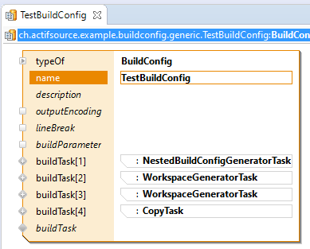

# ch.actifsource.example.buildconfig
In this project we will show how to define a BuildConfig.

## Test BuildConfig

## Requirements
Actifsource  Workbench Community Edition

## License
[http://www.actifsource.com/company/license](http://www.actifsource.com/company/license)